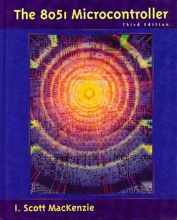
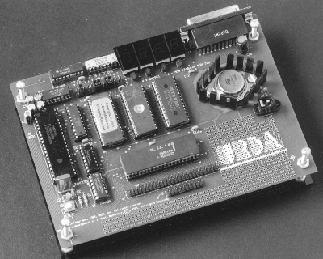

When I was in high school, my cousin got me the ``8051 Microcontroller'' book.
I read it every night.

In that book there is a monitor program for driving SBC51, a single board
computer.

There is a complete source code for mon51 in appendix of that book.
Unfortunately, The link in MacKenzie's homepage is broken, therfore you have to
write it line by line.

hopefully I found mon51 source codes in my old hard drive :).

